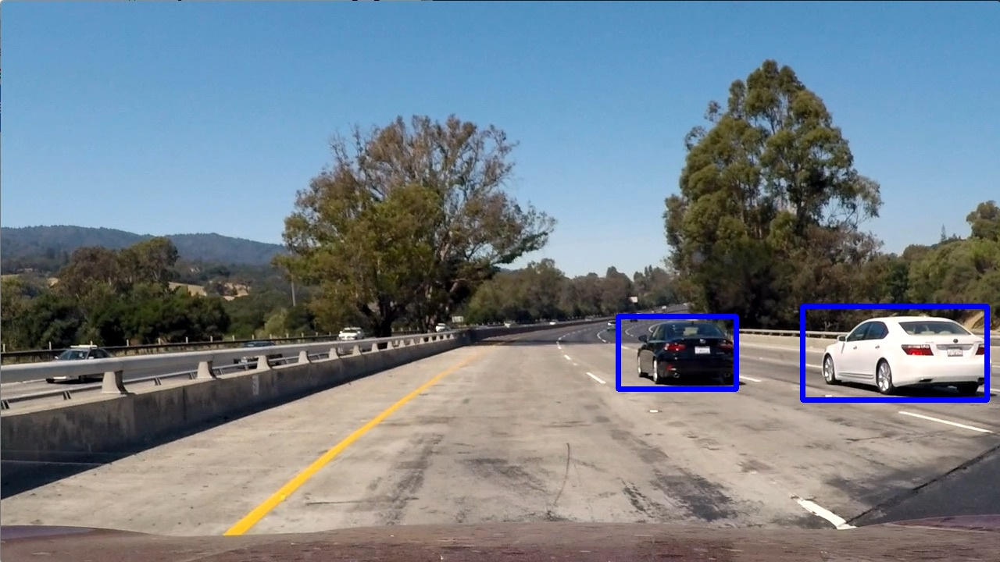

# Vision4j collection
Collection of computer vision models, ready to be included in a JVM project. The idea is to maintain
a list of implementations for different computer vision problems in a plug-and-play format.

## Table of Contents
- [Problems](#problems)
  - [Classification](#classification)
    - [Pretrained VGG16 on ImageNet using DeepLearning4j](#pretrained-vgg16-on-imagenet-using-deeplearning4j)
    - [GRPC classifier](#grpc-classifier)
      - [Keras VGG16 classification](#keras-vgg16-classification)


  - [Segmentation](#segmentation)
    - [GRPC segmentation](#grpc-segmentation)
      - [DeepLabV3 Pascal VOC segmentation](#deeplabv3-pascal-voc-segmentation)
      - [Mask R-CNN pretrained on Coco dataset](#mask-r-cnn-pretrained-on-coco-dataset)


  - [Completion](#completion)
    - [GRPC completion](#grpc-completion)
      - [Gimp Resynthesizer Plugin](#gimp-resynthesizer-plugin)


  - [Detection](#detection)


## Problems


### Classification

By a given image, find the category that the image belongs to. For example, if a model is trained to recognize
the categories: `lion`, `cheetah` and `tiger`, when given an image in one of those categories, it can recognize it.

| Input        | Output
| ------------- |:-------------:|
|  | tiger
|  | cheetah
|  | lion


Classification is not the problem you were looking for? Go back to [table of contents](#table-of-contents)

*How do we measure how good a model is?*

By a given dataset, find the number of correctly classified examples and divide them to the total number of examples in the dataset (classification accuracy).

A list of the most important datasets with leaderboard links:

| Dataset       | Leaderboard
| ------------- |:-------------:|
| ImageNet 2014 Classification + Localization challenge | http://image-net.org/challenges/LSVRC/2014/results#clsloc


Implementations available for the classification problem:

#### Pretrained VGG16 on ImageNet using DeepLearning4j

Trained on the [ImageNet](www.image-net.org/) dataset.

To use this implementation in your project, add the dependency:
```xml
<dependency>
    <groupId>com.vision4j</groupId>
    <artifactId>vgg16-deeplearning4j-classifier</artifactId>
    <version>1.3.0</version>
</dependency>
```

Not what you were looking for? Go back to [table of contents](#table-of-contents)

This implementation uses [ND4J](https://nd4j.org/), so you should add one more dependency depending on whether 
you have GPU or not. You can read more about it [here](https://nd4j.org/getstarted).


Once you have added the dependency and did the necessary setup, you can use it like this:

```java
ImageClassifier imageClassifier = new Vgg16DeepLearning4jClassifier();
Category category = imageClassifier.predict(new File("./cheetah.jpg"));
String name = category.getCategoryName(); // cheetah
int index = category.getIndex(); // 293
```

Minimum required memory for the model: 1.355 GB

Prediction times (in seconds):

Image size | 1080Ti  | K80  | CPU (AMD Ryzen)
-------------| ------------- |:-------------:|:-------------:|
224x224| 0.070 | TODO | 0.730

#### GRPC classifier

Delegates to another classifier (in another languages) through GRPC call.

To use this implementation in your project, add the dependency:
```xml
<dependency>
    <groupId>com.vision4j</groupId>
    <artifactId>grpc-classifier</artifactId>
    <version>1.3.1</version>
</dependency>
```

Not what you were looking for? Go back to [table of contents](#table-of-contents)

This implementation requires a GRPC server running with the classifier. You can use any C++, Python or Lua model. By default, it communicates over localhost on port 50051 and is usually faster than the corresponding DeepLearning4j implementation.
You can read more about GRPC [here](https://grpc.io/).
This model can be combined with any of the following models:

#### Keras VGG16 classification
If you have a GPU:

```bash
nvidia-docker run -it -p 50051:50051 vision4j/grpc-keras-vgg16-classification:gpu
```

If you have only a CPU:

```bash
docker run -it -p 50051:50051 vision4j/grpc-keras-vgg16-classification
```

Not what you were looking for? Go back to [table of contents](#table-of-contents)

Minimum required memory for the model: TODO

Prediction times (in seconds):

Image size | 1080Ti  | K80  | CPU (AMD Ryzen)
-------------| ------------- |:-------------:|:-------------:|
TODO| TODO | TODO | TODO
---

Once you have added the dependency and started the external model, you can use it like this:

```java
ImageClassifier imageClassifier = new GrpcClassifier();
Category category = imageClassifier.predict(new File("./cheetah.jpg"));
String name = category.getCategoryName(); // cheetah
int index = category.getIndex(); // 293
```

The memory requirements and the prediction times depend on the model that is being delegated to.


### Segmentation

By a given image, for each pixel predict what it is. For example, if a model is trained to recognize
`person`, `table` and `bottle`, when given an image, it is able to correctly predict the boundaries of every category of objects. Also called instance segmentation.

| Input        | Output
| ------------- |:-------------:|
|  | 


Segmentation is not the problem you were looking for? Go back to [table of contents](#table-of-contents)

*How do we measure how good a model is?*

By a given dataset, find the average IoU (Intersection over Union) across all given imags. IoU is calculated by taking the intersection between the ground truth and the prediction and dividing it to the union of the ground truth and the prediction

A list of the most important datasets with leaderboard links:

| Dataset       | Leaderboard
| ------------- |:-------------:|
| Coco dataset segmentation | http://cocodataset.org/#detection-leaderboard
| Pascal VOC 2012 | http://host.robots.ox.ac.uk:8080/leaderboard/displaylb.php?challengeid=11&compid=6


Implementations available for the segmentation problem:

#### GRPC segmentation

Delegates to another segmentation model (in another languages) through GRPC call.

To use this implementation in your project, add the dependency:
```xml
<dependency>
    <groupId>com.vision4j</groupId>
    <artifactId>grpc-segmentation</artifactId>
    <version>1.0.1</version>
</dependency>
```

Not what you were looking for? Go back to [table of contents](#table-of-contents)

This implementation requires a GRPC segmentation server. You can use any C++, Python or Lua model. By default, it communicates over localhost on port 50052 and is usually faster than the corresponding DeepLearning4j implementation.
You can read more about GRPC [here](https://grpc.io/).
This model can be combined with any of the following models:

#### DeepLabV3 Pascal VOC segmentation
If you have a GPU:

```bash
nvidia-docker run -it -p 50052:50052 vision4j/deeplabv3-pascal-voc-segmentation:gpu
```

If you have only a CPU:

```bash
docker run -it -p 50052:50052 vision4j/deeplabv3-pascal-voc-segmentation
```

Not what you were looking for? Go back to [table of contents](#table-of-contents)

Minimum required memory for the model: TODO

Prediction times (in seconds):

Image size | 1080Ti  | K80  | CPU (AMD Ryzen)
-------------| ------------- |:-------------:|:-------------:|
TODO| TODO | TODO | TODO
---
#### Mask R-CNN pretrained on Coco dataset
If you have a GPU:

```bash
nvidia-docker run -it -p 50052:50052 vision4j/mask-rcnn-segmentation:gpu
```

If you have only a CPU:

```bash
docker run -it -p 50052:50052 vision4j/mask-rcnn-segmentation
```

Not what you were looking for? Go back to [table of contents](#table-of-contents)

Minimum required memory for the model: TODO

Prediction times (in seconds):

Image size | 1080Ti  | K80  | CPU (AMD Ryzen)
-------------| ------------- |:-------------:|:-------------:|
TODO| TODO | TODO | TODO
---

Once you have added the dependency and started the external model, you can use it like this:

```java
Segmentation seg = new PascalVOC2012GrpcSegmentation();
SegmentationResult res = seg.segment(new File("chess.jpg"));
BufferedImage resultImage = res.getBufferedImage();
```

The memory requirements and the prediction times depend on the model that is being delegated to.


### Completion

By a given image and a missing region in that image, fill in the missing region so that it fits with the rest of the image.

| Input        | Output
| ------------- |:-------------:|
|   | 


Completion is not the problem you were looking for? Go back to [table of contents](#table-of-contents)

*How do we measure how good a model is?*

Different metrics exist for exemplar based inpainting and deep learning based models. One possible evaluator would be Naturalness Image Quality Evaluator (NIQE), or comparing it to the original image. A survey of different quality metrics is available in the paper [A critical survey of state-of-the-art image inpainting quality assessment metrics](https://www.sciencedirect.com/science/article/pii/S1047320317301803)

A list of the most important datasets with leaderboard links:

| Dataset       | Leaderboard
| ------------- |:-------------:|


Implementations available for the completion problem:

#### GRPC completion

Delegates to another completion model (in another languages) through GRPC call.

To use this implementation in your project, add the dependency:
```xml
<dependency>
    <groupId>com.vision4j</groupId>
    <artifactId>grpc-completion</artifactId>
    <version>1.0.1</version>
</dependency>
```

Not what you were looking for? Go back to [table of contents](#table-of-contents)

This implementation requires a GRPC segmentation server. You can use any C++, Python or Lua model. By default, it communicates over localhost on port 50053 and is usually faster than the corresponding DeepLearning4j implementation.
You can read more about GRPC [here](https://grpc.io/).
This model can be combined with any of the following models:

#### Gimp Resynthesizer Plugin
If you have a GPU:

```bash
nvidia-docker run -it -p 50053:50053 vision4j/gimp-completion:gpu
```

If you have only a CPU:

```bash
docker run -it -p 50053:50053 vision4j/gimp-completion
```

Not what you were looking for? Go back to [table of contents](#table-of-contents)

Minimum required memory for the model: TODO

Prediction times (in seconds):

Image size | 1080Ti  | K80  | CPU (AMD Ryzen)
-------------| ------------- |:-------------:|:-------------:|
TODO| TODO | TODO | TODO
---

Once you have added the dependency and started the external model, you can use it like this:

```java
Completion completion = new GimpGrpcCompletion();
CompletionResult res = completion.complete(new File("people.jpg"), new File("mask.jpg"));
BufferedImage resultImage = res.getBufferedImage();
```

The memory requirements and the prediction times depend on the model that is being delegated to.


### Detection

By a given image, found the bounding box for a given category (or multiple categories). For example, if the model is trained to recognize the categories `car` and `pedestrian`, the output would be coordinates of the bounding boxes as well as the classes.

| Input        | Output
| ------------- |:-------------:|
|  | 
|  | 


Detection is not the problem you were looking for? Go back to [table of contents](#table-of-contents)

*How do we measure how good a model is?*

By a given dataset, find the average IoU (Intersection over Union) across all given imags. IoU is calculated by taking the intersection between the ground truth and the prediction and dividing it to the union of the ground truth and the prediction

A list of the most important datasets with leaderboard links:

| Dataset       | Leaderboard
| ------------- |:-------------:|
| Coco dataset segmentation | http://cocodataset.org/#detection-leaderboard


Implementations available for the detection problem:


