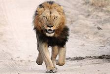
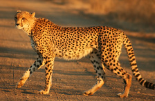
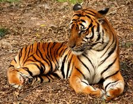

# vision4j-collection
Collection of computer vision models, ready to be included in a JVM project. The idea is to maintain
a list of implementations for different computer vision problems in a plug-and-play format.

## Problems

### Image classification

By a given image, find the category that the image belongs to. For example, if a model is trained to recognize
the categories: `lion`, `cheetah` and `tiger`, when given an image in one of those categories, it can recognize it.

| Input        | Output           
| ------------- |:-------------:| 
|  | lion 
|  | cheetah
|  | tiger

Implementations available for this problem:

#### Pretrained VGG16 on ImageNet using DeepLearning4j

Trained on the [ImageNet](www.image-net.org/) dataset.
To use this implementation in your project, add the dependency:

```xml
<dependency>
    <groupId>com.vision4j</groupId>
    <artifactId>vgg16-deeplearning4j-classifier</artifactId>
    <version>1.1.0</version>
</dependency>
```

This implementation uses [ND4J](https://nd4j.org/), so you should add one more dependency depending on whether
you have GPU or not. You can read more about it [here](https://nd4j.org/getstarted).

Once you have added the dependency, you can use it like this:

```java
ImageClassifier imageClassifier = new Vgg16DeepLearning4jClassifier();
Category category = imageClassifier.predict(new File("./cheetah.jpg"));
String name = category.getCategoryName(); // cheetah
int index = category.getIndex(); // 293
```

Minimum required memory for the model: 1.355 GB

Prediction times (in seconds):

| 1080Ti  | K80  | CPU (AMD Ryzen)
| ------------- |:-------------:|:-------------:| 
| 0.07 | TODO | 0.73

TODO:
* docker / nvidia-docker images
* AWS AMI
* Training measurements and estimations
